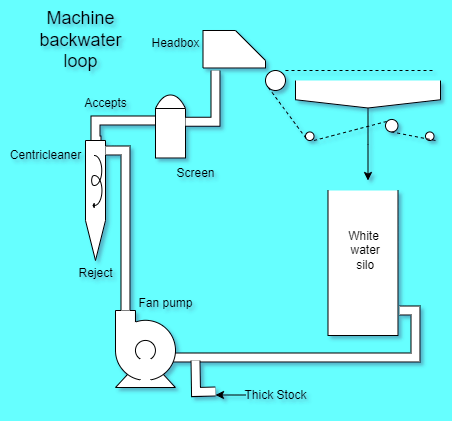

The stock flow system from Fan pump to headbox slice is called approach flow system.

It refers specifically to the fan pump loop where pulp mixture is measured, diluted, mixed with necessary additives, and finally screened and cleaned
before being discharged on to paper machine wire.

 
<figure>

<figcaption  style = "font-size :13px" >  Approach Flow System </figcaption>
</figure>

The approach flow system is a crucial part of the papermaking process that lies between the final stock preparation storage tanks and the headbox of the paper machine.   

  
It is made up of several unit operations, including deaeration, mixing, and machine screening.  

The primary function of the approach flow system is to prepare the stock for the paper machine by removing air, impurities, and other contaminants from the pulp .  

An integrated approach flow system can be designed to the needs of the paper grade, featuring advanced solutions for deaeration, mixing, and machine screening.   

Deaeration refers to the removal of air, which can have negative effects on downstream equipment and the quality of the final product.
  
Advanced mixing technologies for thick stock mixing and retention aid mixing are used in modern machine approach flow systems.  

Machine screening is another critical component of the approach flow system.

Based on the design features of the outflow-type screen and the interaction of the  rotor and foil designs, machine screens ensure the risk-free operation of paper, board, and tissue machines.

