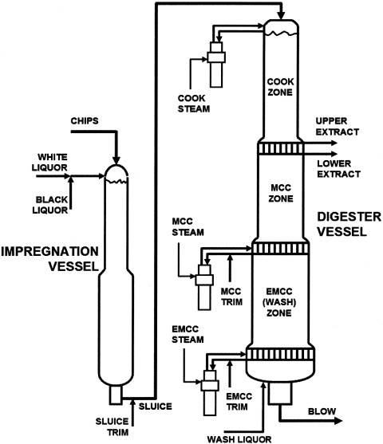

Most of the old pulp mills uses batch digesters for pulp production.
Recent Mills use continuous digesters for pulp production.

In a continuous digester wood chips and liquor are fed continuously to a pressure vessel and pulp is also withdrawn
continuously. 

The advantage of continuous pulping are requirement of less space,better cooking control and energy efficiency.
<figure>
  
       <figcaption  style = "font-size :13px" >Continuous Digester  Image Source:Wet-end Chemistry M. Hubbe </figcaption>
       </figure>