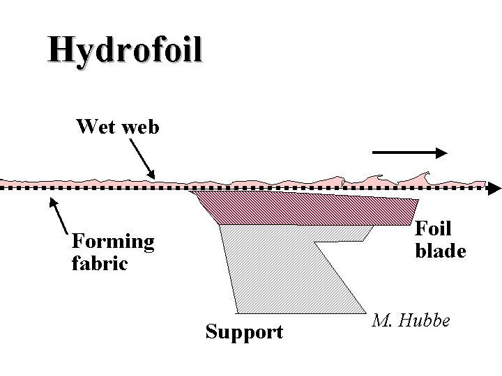

Hydrofoils are  used in forming section of paper machine to help drainage. 

It is also called dewatering element.  
Their shape is designed to create suction as the foil and wet web pass over the surface.

Hydrofoils are stationary elements that have a short horizontal surface and a long oblique surface along the machine direction.

The angle of the oblique surface can vary from 1° to 5° depending on the desired effect. 

Hydrofoils create a pressure difference between the two surfaces, which causes the water to be removed from the paper stock as it passes over them.

Hydrofoils also help to reduce the drag on the forming fabric and improve the formation and strength of the paper sheet.

Hydrofoils also create a brief pressure pulse as the fabric passes over the leading edge.
The alternating pressure and vacuum of a series of hydrofoils tends to move fibers around in the wet web, slightly improving
the drainage and uniformity of the resulting paper.

<figure>

      <figcaption style = "font-size :13px" > Image Source Wet-end Chemistry M Hubbe </figcaption>
      </figure>