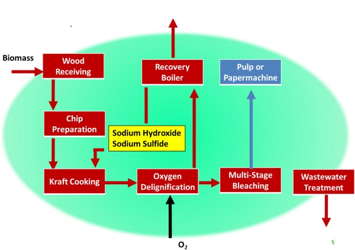
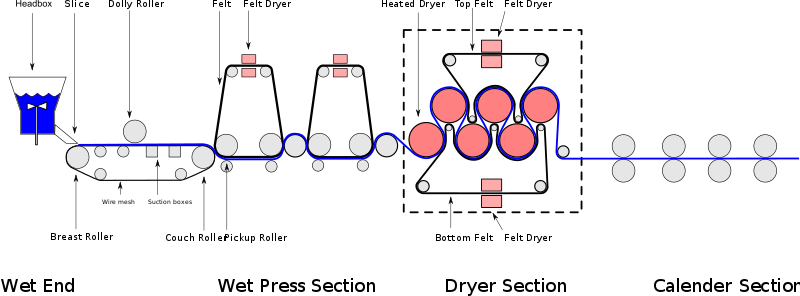

Paper is a thin sheet usually manufactured from cellulose pulp derived from wood and other lignocellulosic materials.  

It is believed that paper originated in China in the 2nd century.
Initially, paper was made manually as single sheets until the invention of paper machine.  

There are mainly two processes Pulp production in pulp mill and further processing of pulp to paper sheet.  

In pulp mill,  pulp is mostly made by chemical process in the following steps.
1. Wood is converted to chips.
2. Chips are fed to a digester modern mill uses continuous digesters.
3. Caustic and sodium sulfide solution (White Liquor) is then added in the digester.
4. The digester is heated with steam for several hours.
5. After several hours heating resultant pulp is released in a low pressure tank. In this process pulp is blown and fibers separates,the pulp now called
brown stock.
6. This pulp is the washed in counter current washers known as brownstock washers. and the resultant washed liquor known as black liquor is sent to
recovery plant for heat and chemical recovery.
7. The washed pulp is sent to bleaching section for further processing or sent to paper machine as such for kraft paper production.

<figure>

<figcaption style = "font-size :13px"  >Pulp mill process diagram</figcaption>
</figure>

Bleached or unbleached pulp from pulp mill is sent to paper machine in stock preparation area where pulp is mixed with some ingredients like fillers ,
colors,brightening agents etc.  
Pulp is passed through refiners in this section to make fine fibers for better quality paper.   
The pulp is pumped to machine through various stages  of chest storage like blending chest,refined chest etc to final machine chest where retention
time ia approx 15 minutes.   
From machine chest pulp is sent to a constant level box.(CLB),From CLB pump goes to fan pump where dilute machine back water is mixed in it.  
From fan pump dilute pulp about 0.4% to 0.8% is sent to paper machine head-box through centricleaners. 

Paper machine has following sections forming section,press section,drying section,calendering and reeling.

### Forming or wet-end 
From the machine chest stock is pumped to a head tank, commonly called a "head tank" or stuff box, whose purpose is to maintain a constant head
(pressure) on the fiber slurry or stock as it feeds the basis weight valve.  
The stuff box also provides a means allowing air bubbles to escape.   
The consistency of the pulp slurry at the stuff box is in the 3% range.  
Flow from the stuff box is by gravity and is controlled by the basis weight valve on its way to the fan pump suction where it is injected into the main
flow of water to the fan pump.   
The main flow of water pumped by the fan pump is from a whitewater chest or tank that collects all the water drained from the forming section of the
paper machine.

Before the fiber stream from the stuff box is introduced, the whitewater is very low in fiber content.  
The whitewater is constantly recirculated by the
fan pump through the headbox and recollected from the wire pit and various other tanks and chests that receive drainage from the forming wire and vacuum
assisted drainage from suction boxes and wet fiber web handling rolls.  
On the way to the head box the pulp slurry may pass through centrifugal cleaners, which remove heavy contaminants like sand, and screens, which break up
fibre clumps and remove oversize debris.

The purpose of the head-box is create turbulence to keep the fibers from clumping together and to uniformly distribute the slurry across the width of
the wire.  
Wood fibers have a tendency to attract one another, forming clumps, the effect being called flocculation.  
Flocculation is lessened by lowering
consistency and or by agitating the slurry; however, de-flocculation becomes very difficult at much above 0.5% consistency.  
Minimizing the degree of
flocculation when forming is important to physical properties of paper.  

The consistency in the head-box is typically under 0.4% for most paper grades, with longer fibres requiring lower consistency than short fibres. 
Higher consistency causes more fibres to be oriented in the z direction, while lower consistency promotes fibre orientation in the x-y direction.
Higher consistency promotes higher calliper (thickness) and stiffness, lower consistency promotes higher tensile and some other strength properties
and also improves formation (uniformity).
Many sheet properties continue to improve down to below 0.1% consistency; however, this is an impractical amount of water to handle. (Most paper
machine run a higher head-box consistency than optimum because they have been sped up over time without replacing the fan pump and head-box. There is
also an economic trade off with high pumping costs for lower consistency).

The stock slurry, often called white water at this point, exits the head box through a rectangular opening of adjustable height called the slice, the
white water stream being called the jet and it is pressurized on high speed machines so as to land gently on the moving fabric loop or wire at a speed t
typically between plus or minus 3% of the wire speed, called rush and drag respectively.
Excessive rush or drag causes more orientation of fibres in the machine direction and gives differing physical properties in machine and cross
directions; however, this phenomenon is not completely avoidable on Fourdrinier machines.

On lower speed machines at 700 feet per minute, gravity and the height of the stock in the headbox creates sufficient pressure to form the jet through
the opening of the slice. The height of the stock is the head, which gives the head-box its name. The speed of the jet compared to the speed of the wire
is known as the jet-to-wire ratio. When the jet-to-wire ratio is less than unity, the fibres in the stock become drawn out in the machine direction. 

On slower machines where sufficient liquid remains in the stock before draining out, the wire can be driven back and forth with a process known as shake. This provides some measure of randomizing the direction of the fibres and gives the sheet more uniform strength in both the machine and cross-machine directions. On fast machines, the stock does not remain on the wire in liquid form long enough and the long fibres line up with the machine. When the jet-to-wire ratio exceeds unity, the fibers tend to pile up in lumps. The resulting variation in paper density provides the antique or parchment paper look.

Two large rolls typically form the ends of the drainage section, which is called the drainage table. The breast roll is located under the flow box,
the jet being aimed to land on it at about the top centre. At the other end of the drainage table is the suction (couch) roll. The couch roll is a
hollow shell, drilled with many thousands of precisely spaced holes of about 4 to 5 mm diameter. 
The hollow shell roll rotates over a stationary suction box, normally placed at the top centre or rotated just down machine. Vacuum is pulled on the
suction box, which draws water from the web into the suction box. From the suction roll the sheet feeds into the press section.

Down machine from the suction roll, and at a lower elevation, is the wire turning roll. This roll is driven and pulls the wire around the loop.
The wire turning roll has a considerable angle of wrap in order to grip the wire.

Supporting the wire in the drainage table area are a number of drainage elements. In addition to supporting the wire and promoting drainage, 
the elements de-flocculate the sheet. On low speed machines these table elements are primarily table rolls. As speed increases the suction
developed in the nip of a table roll increases and at high enough speed the wire snaps back after leaving the vacuum area and causes stock to jump off
the wire, disrupting the formation. To prevent this drainage foils are used. The foils are typically sloped between zero and two or three degrees and
give a more gentle action. Where rolls and foils are used, rolls are used near the headbox and foils further down machine. Ultrasonic foils can also be
used, creating millions of pressure pulses from imploding cavitation bubbles which keep the fibres apart, giving them a more uniform distribution.

Approaching the dry line on the table are located low vacuum boxes that are drained by a barometric leg under gravity pressure. After the dry line are
the suction boxes with applied vacuum. Suction boxes extend up to the couch roll.   
At the couch the sheet consistency should be about 25%.

### Press section  
The second section of the paper machine is the press section, which removes much of the remaining water via a system of nips formed by
rolls pressing against each other aided by press felts that support the sheet and absorb the pressed water.
The paper web consistency leaving the press section can be above 40%.  
Pressing is the most efficient method of de-watering the sheet as only mechanical action is required.

Presses can be single or double felted.  
A single felted press has a felt on one side and a smooth roll on the other.  
A double felted press has both
sides of the sheet in contact with a press felt.
Simple press rolls can be rolls with grooved or blind drilled surface.  
More advanced press rolls are suction rolls.  
These are rolls with perforated
shell and cover.  
The shell made of metal material such as bronze stainless steel is covered with rubber or a synthetic material. Both shell and cover
are drilled throughout the surface.  
A stationary suction box is fitted in the core of the suction roll to support the shell being pressed. End face
mechanical seals are used for the interface between the inside surface of the shell and the suction box. For the smooth rolls, they are typically made
of granite rolls.  
The granite rolls can be up to 30-foot (9.1 m) long and 6 feet (1.8 m) in diameter.

Conventional roll presses are configured with one of the press rolls is in a fixed position, with a mating roll being loaded against this fixed roll.
The felts run through the nips of the press rolls and continues around a felt run, normally consisting of several felt rolls. During the dwell time
in the nip, the moisture from the sheet is transferred to the press felt. When the press felt exits the nip and continues around, a vacuum box known
as an Uhle Box applies vacuum (normally -60 kPa) to the press felt to remove the moisture so that when the felt returns to the nip on the next cycle,
it does not add moisture to the sheet.

Some grades of paper use suction pick up rolls that use vacuum to transfer the sheet from the couch to a lead in felt on the first press or between
press sections. Pickup roll presses normally have a vacuum box that has two vacuum zones (low vacuum and high vacuum). These rolls have a
large number of drilled holes in the cover to allow the vacuum to pass from the stationary vacuum box through the rotating roll covering.
The low vacuum zone picks up the sheet and transfers, while the high vacuum zone attempts to remove moisture. Unfortunately, at high enough speed
centrifugal force flings out vacuumed water, making this less effective for dewatering. Pickup presses also have standard felt runs with Uhle boxes.
However, pickup press design is quite different, as air movement is important for the pickup and dewatering facets of its role.

### Dryer section 
The dryer section of the paper machine, as its name suggests, dries the paper by way of a series of internally steam-heated cylinders
that evaporate the moisture.  
Steam pressures may range up to 160 psig.  
Steam enters the end of the dryer head (cylinder cap) through a steam joint a
nd condensate exits through a siphon that goes from the internal shell to a centre pipe. From the centre pipe the condensate exits through a joint
on the dryer head.   
Wide machines require multiple siphons. In faster machines, centrifugal force holds the condensate layer still against the shell
and turbulence generating bars are typically used to agitate the condensate layer and improve heat transfer.

The sheet is usually held against the dryers by long felt loops on the top and bottom of each dryer section. The felts greatly improve heat transfer.
Dryer felts are made of coarse thread and have a very open weave that is almost see through, It is common to have the first bottom dryer section
unfelted to dump broke on the basement floor during sheet breaks or when threading the sheet.

Paper dryers are typically arranged in groups called sections so that they can be run at a progressively slightly slower speed to compensate for
sheet shrinkage as the paper dries. Some grades of paper may also stretch as they run through the machine, requiring increasing speed between
sections.  
The gaps between sections are called draws.

The drying sections are usually enclosed to conserve heat.  
Heated air is usually supplied to the pockets where the sheet breaks contact with the
driers. This increases the rate of drying. The pocket ventilating tubes have slots along their entire length that face into the pocket. The dryer
hoods are usually exhausted with a series of roof mounted hood exhausts fans down the dryer section.

### Reel section   
After calendering, the web has a moisture content of about 6% (depending on the furnish). The paper is wound onto metal spools using a
large cylinder called a reel drum. Constant nip pressure is maintained between the reel drum and the spool, allowing the resulting friction to spin
the spool.  
Paper runs over the top of the reel drum and is wound onto the spool to create a master roll.
To be able to keep the paper machine running continuously, the reel must be able to quickly switch from winding a finished roll to an empty spool
without stopping the flow of paper. To accomplish this, each reel section will have two or more spools rotating through the process.
Using an overhead crane, empty spools will be loaded onto two primary arms above the reel drum. When the master roll reaches its maximum diameter,
the arms will lower the new spool into contact with the reel drum and a machine behind the drum will run a tape along the moving sheet of
paper, swiftly tearing it and attaching incoming paper onto the new spool. The spool is then lowered onto the secondary arms, which steadily guide
the spool away from the reel drum as the diameter of paper on the spool increases.
<figure>

<figcaption style = "font-size :13px"  >Papermaking process schematic diagram </figcaption>
</figure>

### Other reference

[Wikipedia](https://en.wikipedia.org/wiki/Papermaking)