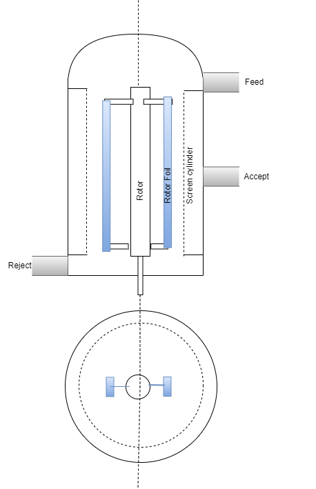

Pressure screen is used for thin stock cleaning to remove large fiber bundles and other hard contaminants.  

They have baskets screens with either slots or holes through which only individual fibers can pass.  

These screens have rotors inside baskets to continuously disperse the slurry.  

 <figure>
    
     <figcaption style = "font-size :13px"  >Pressure Screen</figcaption>
       </figure>